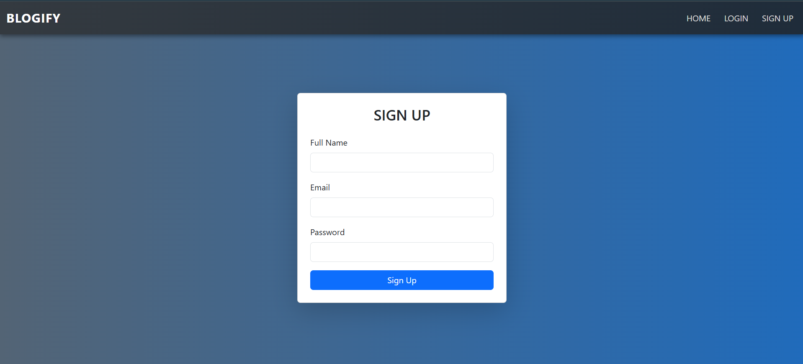
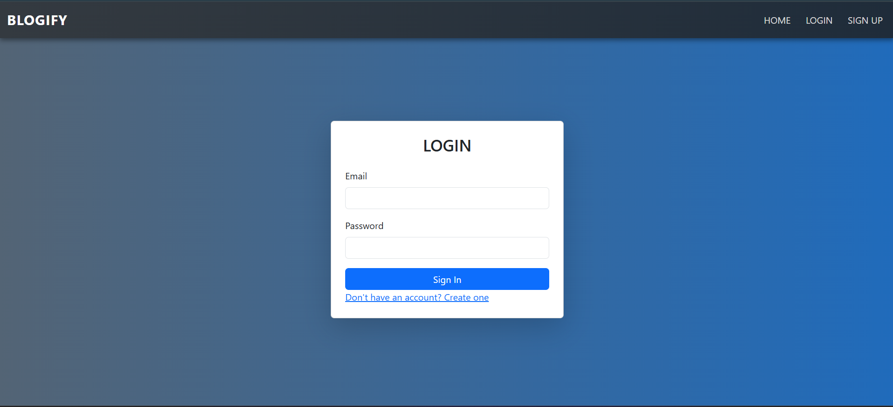
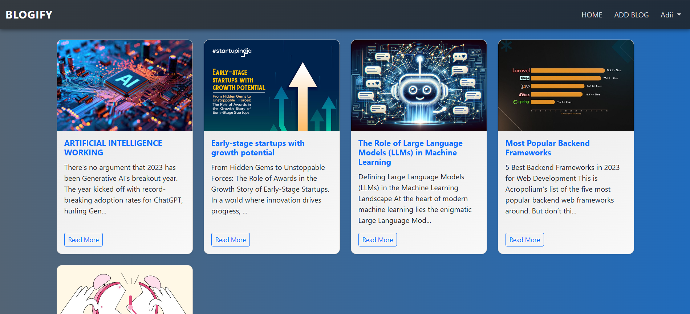
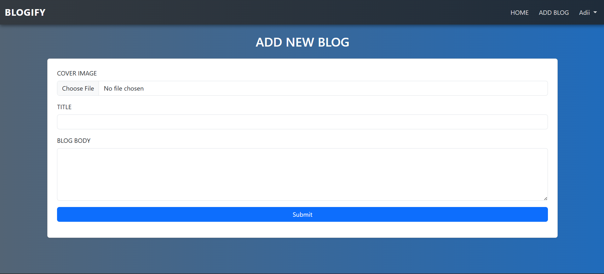
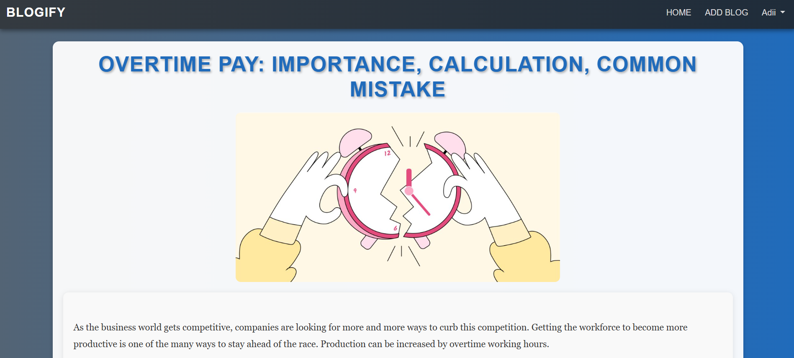
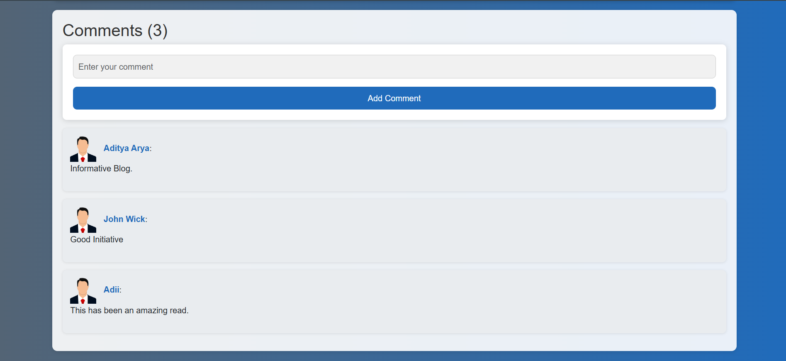
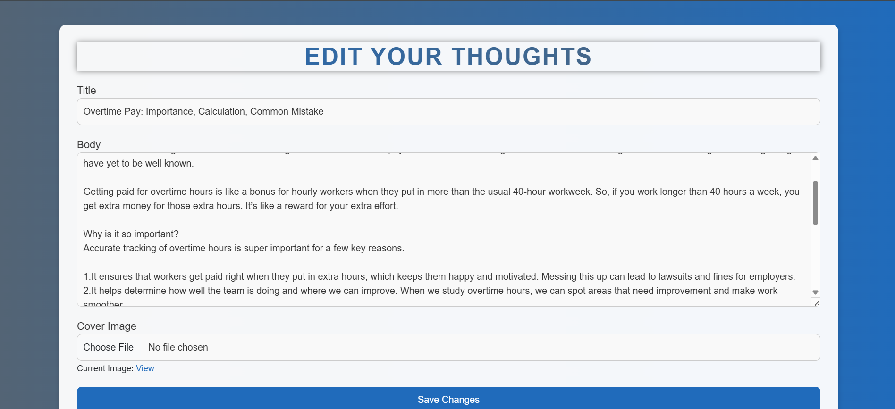

# 📝 Blog Web Application

A full-stack blog platform built using **Node.js**, **Express.js**, **MongoDB**, and **EJS**. This application allows users to register, log in, write blogs, upload images, edit and delete their posts, and comment on others’ blogs. It features a clean UI, secure authentication, and a modular folder structure.

---

## 🚀 Features

- 🔐 User Signup and Login
- ✍️ Create, View, Edit, and Delete Blog Posts
- 💬 Comment System
- 🖼️ Image Upload for Blogs
- 📱 Responsive UI with EJS Templating
- 🧠 Session-based Authentication
- 📦 Clean MVC File Structure

---

## 🖼️ Screenshots & Demo

> 📂 Screenshots are located in the `ScreenShots/` folder. Add these files to your GitHub repository to enable previews.

### 🔑 Signup Page  


### 🔐 Login Page  


### 🏠 Home Page  


### ➕ Add Blog Page  


### 📄 Blog View Page  


### 💬 Comment Section  


### ✏️ Edit Blog Page  


### 📽️ Blog & Comment Interaction (Video)  
🎬 [Click to watch demo](./ScreenShots/blog nd comment.mp4)

---

## 🛠️ Tech Stack

- **Frontend:** HTML, CSS, EJS
- **Backend:** Node.js, Express.js
- **Database:** MongoDB
- **Templating Engine:** EJS
- **Authentication:** Express Sessions, bcrypt
- **File Uploads:** multer

---

## 📁 Project Folder Structure

BLOG-APP/
├── middlewares/
├── models/
├── node_modules/
├── public/
│ ├── images/ # Static assets
│ └── uploads/ # 📌 Uploaded blog images (create manually)
├── routes/
├── services/
├── views/
│ └── partials/
├── ScreenShots/ # 📸 Add images and demo video here
├── .gitignore
├── .env # 🔒 Add your Mongo URI and session secret here
├── package.json
├── README.md

---

## 🧪 How to Run Locally

1. **Clone the Repository**
   ```bash
   git clone https://github.com/yourusername/blog-app.git
   cd blog-app

2. Install Dependencies
   -npm install

3. Setup Environment Variables
   -Create a .env file in the root directory and add:
      -MONGODB_URI=your_mongodb_connection_string
      -SESSION_SECRET=your_secret_key

4. Create Upload Folder
   -Manually create the following folder:
      -public/uploads/

5. Run the App
   -npm start

6. Open your browser and go to:
   -http://localhost:8000

🙋‍♂️ Author
Aditya Arya
📧 adityaarya5141@gmail.com || 🎓 B.Tech IT @ AKGEC (2021–25)

⭐ Show Your Support
If you found this project useful or interesting, please consider giving it a ⭐ on GitHub and sharing your feedback!
   
